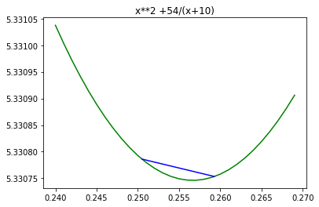

# Mi primer cosa en nbdev
> División de Intervalos por la Mitad implementacion de Optimización.


```
import matplotlib.pyplot as plt
```

## Install

`pip install optimizacion`

## How to use

```
def f(x):
     return x**2 +54/(x+10)
```

```
def DivisionIntervalos(a, b, epsilon):
    xm = (a+b)/2.
    L = b-a
    
    evalxm = f(xm)
    
    while abs(L) > epsilon:        
        x1 = a+L/4.
        x2 = b-L/4.
        evalx1 = f(x1)
        
        if evalx1 < evalxm:
            b, xm = xm, x1
            evalxm = evalx1
        else:
            # Si se evalua f(x2) hasta este punto, se ahorran varias evaluaciones al no entrar a esta parte del if
            evalx2 = f(x2)
            if evalx2 < evalxm:
                a, xm = xm, x2
                evalxm = evalx2
            else:
                a, b = x1, x2
        L = b-a
        
    sol1 = "{0:.3f}".format(a)
    sol2 = "{0:.3f}".format(b)
    print(f"({sol1},{sol2})")
    return a, b
```

```
x1, x2 = DivisionIntervalos(-9,9,0.01)
```

    (0.250,0.259)


Así luce el resultado (azul) con la función original (verde).

```
evaluados = [f(i/1000) for i in range(240, 270, 1)]
x = [i/1000 for i in range(240, 270, 1)]

plt.plot(x,evaluados, color="g")
plt.plot([x1,x2],[f(x1),f(x2)],color= 'b')
plt.title("x**2 +54/(x+10)")
plt.show()
```




